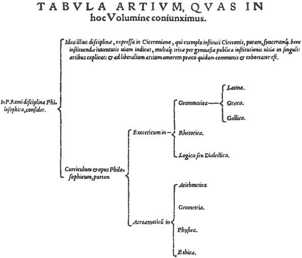

# Hierarchy Tree Creator
  Want to give it a tree structure with strings and get back a file with Hierarchy Tree(inspired by ramist diagrams)  
  In C++ for learning   

Eg:  

    
  
## Todo  
- Make dimensions dependent on font height instead of height, weight
- Calculate padding based on dimensions of all children together
