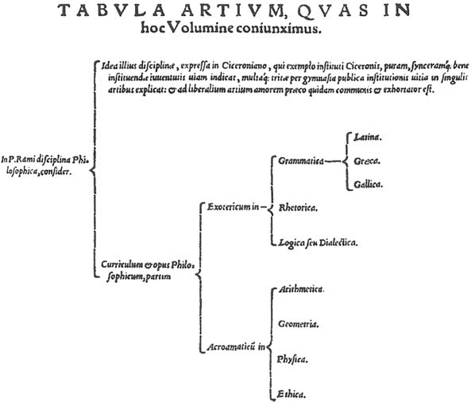

# Hierarchy Tree Creator
  Creates a non-layered Hierarchical tree from a Tree data structure. Inspired by Ramist diagrams. 

Eg:  

    
  
## Todo  
- Fix Memory Leaks from calc_text and draw_text
- Center Parents in between their children while maintaining appropriate space
- Improve Logging system
- Add command arguments
- Calculate required image dimensions from font size
